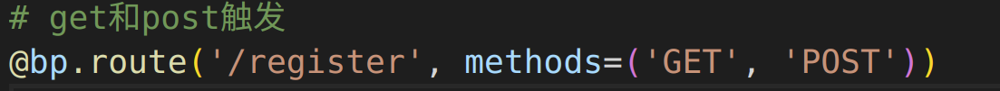
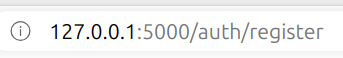
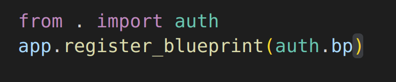
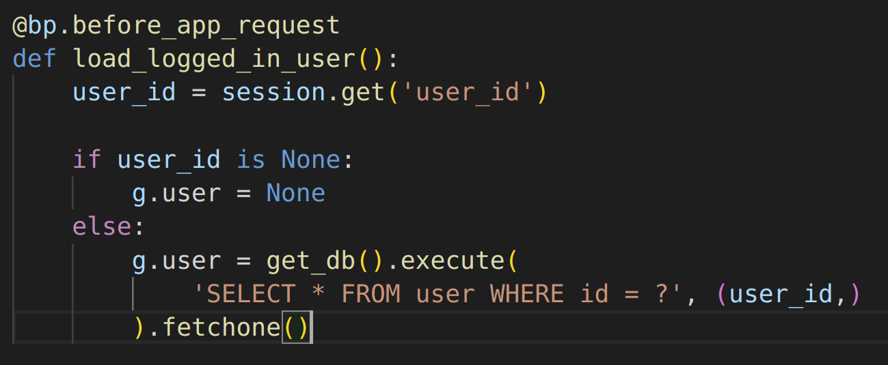
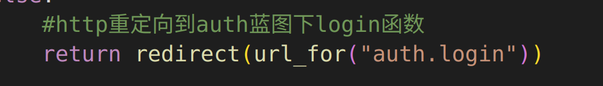
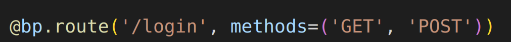

### 导入必要库

```
import functools

from flask import (
    Blueprint, flash, g, redirect, render_template, request, session, url_for
)

from flaskr.db import get_db
```

### 设置Blueprint蓝图

`bp = Blueprint('auth', __name__, url_prefix='/auth')`

* 'auth'是蓝图名称，这个很重要
* url_prefix是蓝图的根路径

#### url_prefix效果展示

如url_prefix='/auth'蓝图下定义了/register路由



效果如下



所以可以说url_prefix的值是一个模块的起始值

* url_prefix+路由=真正的路由

### 注册Blueprint

需要在__init__.py里面注册蓝图



这就是我说的蓝图的名称很重要，后续还有很多地方需要用蓝图的名称

* 注意，不注册蓝图不能使用
* 注册蓝图也有先后顺序，比如a蓝图调用b蓝图，那么b蓝图应该先注册

### 蓝图的作用

#### 统一管理模块内路由

如我们上面所述，对于一个模块内的路由，同过url_prefix进行统一管理

#### 预处理



上述例子表示在 **用户登录蓝图** 的**所有请求前**进行加载用户

#### 重定向



什么是重定向呢，简单来说就是服务器执行的跳转路由

* 你当前的路由是localhost:80/a/b , 给你跳转到localhost:80/k/f/g
* redirect：重定向

* auth.login:表示auth蓝图下的/login路由



当然我们知道/login实际上是url_prefix+/login=/auth/login

* 那么除了对本蓝图的重定向，能不能对其他蓝图重定向呢？
* 当然可以，不过你得执行 设置蓝图 和 注册蓝图 两个步骤，最重要的是，你如果对其他蓝图重定向，那么其他蓝图应该先于本蓝图注册

#### 渲染模板


表示渲染template下的auth/register.html文件，template是固定不变的，渲染了模板用户就可以看到你的html文件了，当然这个是最重要的
