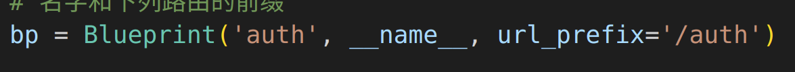
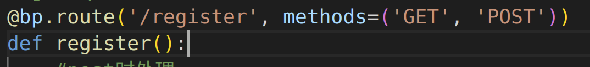
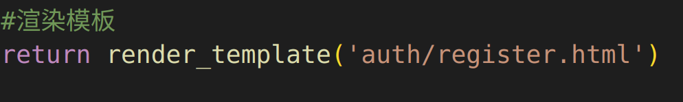
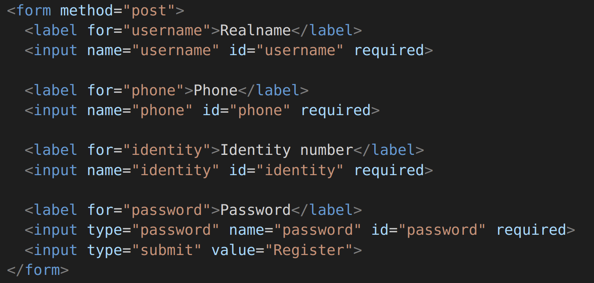
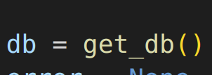
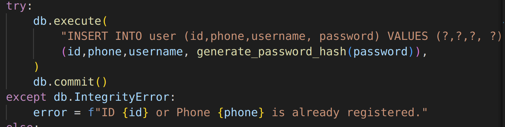
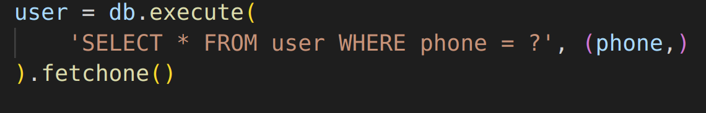
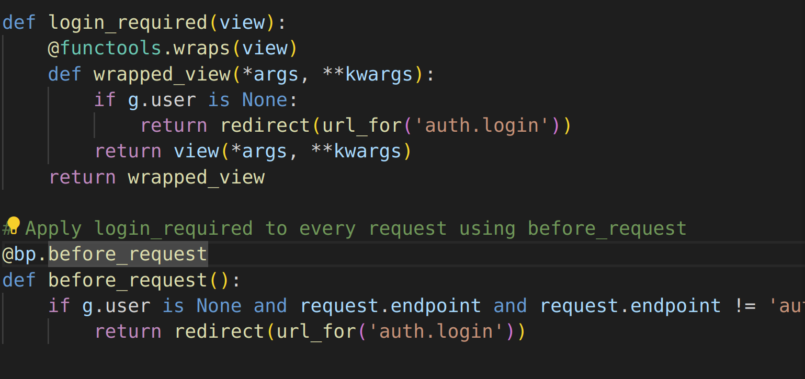

* 什么是路由

  

  121.0.0.1是我们电脑的ip地址

  5000是端口号

  端口号后面的 / 的内容就是路由，简单来说，就是把我们的网页分级分层

### 蓝图中操作路由和请求

#### 路由

'/register'就是路由，完整路由是url_prefix+/register

* 表示在auth模块下的register的任务
* 同时也向用户展示了注册的页面

#### 请求

methods=get,post,表示本路由执行get和post

* 获取请求 `request.method == 'POST':`

##### get

表示获取当前页面，一般来说对get的处理就是渲染当前页面的html就行了

实际路径tempalte/auth/register.html

##### post

表示提交表单,提交表单的html当然是get渲染的html了

tempalte/auth/register.html

* 获取表单属性:` request.form['phone']`表示获取 `<input name="phone">这个标签里面的内容`

当然还有很多请求如head，put，delete等，根据需要去使用

### 数据库

获取数据库，这个我已经写好了，直接用就行了

#### 插入数据库

* 包裹在try-except里面
* execute表示执行查看结果，但是不会插入，commit后才会真的插入
* 保存错误信息调用flash(error)打印错误信息

#### 查询数据库

* fetchone返回一行数据，用于单用户查询
* fetchall返回所有数据，用于多用户查询

### 强制用户登录才能查看其他视图

g.user为空就只能在auth.login里

配合蓝图的预处理功能

* 形成完整的用户不登录，就只能给用户重定向到登录路由
